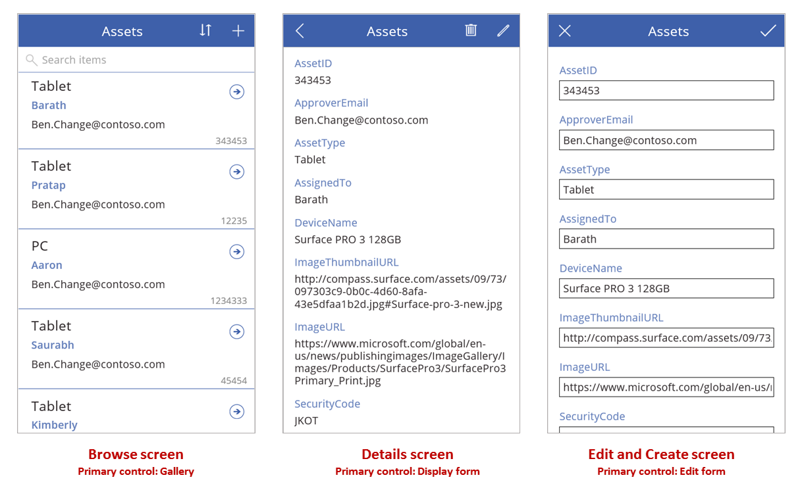
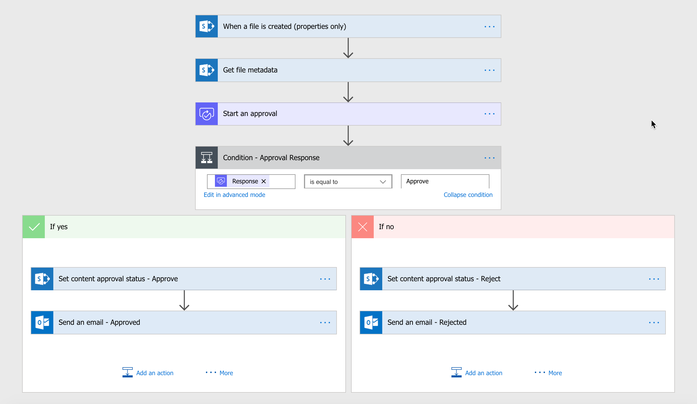

#### SharePoint Migration Plan for Chevron Phillips Chemical Co. (Transportation & Logistics Team)
##### Summer 2019
---
# Table of contents
1. [Project Overview](#Overview)
2. [Project Scope](#Scope)
3. [High-Level Requirements](#Requirements)
4. [Deliverables](#Deliverables)
5. [Affected Parties](#Impacted)
6. [Tentative Schedule](#Schedule)
7. [Challenges](#Challenges)
8. [Results](#Results)

---
1. Project Overview    
_`Describe how this project came about, who is involved, and the purpose.`_  
Chevron Phillips Chemical Company (CPChem) needed to migrate all SharePoint On-Prem sites to SharePoint Online. The Transportation & Logistics (T&L) team was one of the few teams that had not begun migrating their SharePoint sites by May 2019. T&L had one of the largest SharePoint site collections (measured in terabytes) within CPChem.
2. Project Scope   
_`Project scope defines the boundaries of a project. Think of the scope as an imaginary box that will enclose all the project elements/activities. Scope answers questions including what will be done, what won’t be done, and what the result will look like.`_  
    * Migrate existing functionality and content from SharePoint On-Prem to SharePoint Online and improve functionality where possible using SharePoint Online tools.
    * Verify user roles for SharePoint sites are appropriate based on principle of least privilege.
    * CPChem’s SharePoint team does not anticipate substantive changes required to existing SharePoint site structure/hierarchy.
    * Training T&L users on SharePoint Online is not within scope although we do encourage T&L members to attend a training session. Synchronous and asynchronous trainings are available to CPChem employees.
    * Enhance site security (compared to T&L’s existing SharePoint On-Prem sites) where possible.
3. High-Level Requirements   
_`Describe how this project came about, who is involved, and the purpose.`_   
The migration project must include the following:
    * Demonstrate to T&L that the migration will not adversely impact day-to-day operations during migration nor result in any loss of data.
    * T&L’s workflow must not be negatively impacted after migration is complete (necessary tasks should not become more difficult).
    * The integrity of existing content included in the migration must be maintained.
4. Deliverables   
_`Project deliverables refer to all the outputs - tangible or intangible - that are submitted within the scope of a project.`_  
    * Project Plan
    * Weekly Status Report
    * Meeting Minutes
    * Homepage Prototype (design)
    * Completed and Live SharePoint Online Site for T&L
5. Affected Parties   
_`List agencies, stakeholders or divisions which will be impacted by this project and describe how they will be affected by the project.`_  
    * Transportation and Logistics team of CPChem manages, edits, and visits their own SharePoint sites daily; some content/functionality is necessary for business operations.
    * Internal partners: Finance team and legal team (regular visitors of T&L’s SharePoint sites)
    * External partners: Suppliers and shipping partners use portions of T&L’s SharePoint sites for guidelines & other documents.
6. Tentative Schedule   
_`Describe what the high level timeline/schedule will be to plan, design, develop and deploy the project. Generally, by when do you expect this project to be finished?`_  
    * Week 0: Kick-off meeting (T&L will explain how they use current SharePoint On-Prem sites, pain points, and wants/needs of SharePoint Online sites.)
    * Week 1: Delete/Migrate/Rebuild assessment of existing SharePoint site pages & content (stakeholders will determine what should be deleted, migrated (as-is), or rebuilt from scratch.)
    * Week 2: Define technical strategies for migration (automated tools, scripts, etc.)
    * Week 3: Identify necessary changes and “wish-list” changes for each site/page
    * Week 4: Create homepage prototype
    * Week 5: Perform test migration and assess results; proceed to full migration
    * Weeks 6-7: Verify full migration outcome; begin necessary and “wish-list” enhancements identified during week 3; finalize decisions for custom additions to SharePoint Online sites such as Power BI, Power Apps, and Power Automate
    * Weeks 8-9: Complete enhancements and custom additions; test functionality
    * Week 10: Close-out meeting with T&L stakeholders with full walkthrough of completed SharePoint Online sites
7. Challenges   
_`Describe the challenges that occurred during the project. How were they resolved?`_  
    * Communication: T&L is a large group that performs various functions; not all personnel need to be part of every discussion. The most straightforward and efficient way I determined who to loop in on conversations was by reaching out to the person who edited specific pages the most and allowing them to forward meeting invites to the necessary personnel.
    * Scheduling: Coordinating meetings over 1 hour with several T&L personnel was more difficult than I anticipated. As a result, many weekly meetings were conducted over a series of 30-minute meetings instead of 1-2 hour single meetings. Communicating as much information as possible through an asynchronous medium alleviated this issue.
    * Learning by doing: Prior to working at CPChem, I did not have any experience with SharePoint other than being a site visitor. To minimize delays, I learned various aspects of SharePoint at least one week in advance of when I would have to use the knowledge. For example, I learned about SharePoint migration during Weeks 0-1 since technical plans for migration would not be discussed until Week 2.  
8. Results   
_`Describe the outcomes and highlights of the project. Were the requirements met? Was the project completed within scope?`_  
    * Migration to SharePoint Online, including enhancements and additions, was successfully completed by the set deadline within scope.
    * Power Apps and Power Automate were used to improve the workflow of T&L.
        * Forms were created using Power Apps to eliminate the need to directly edit certain spreadsheets. Forms were equipped with data validation features and required fields to enforce T&L’s expectations for collected data. Forms were also mobile friendly so they can be easily completed from phones and tablets which was extremely difficult with the preceding spreadsheet versions.
        * Power Automate was used to set up automated approval processes for T&L specific requests instead of ad-hoc emailing and spreadsheets with “yes/no” approve status fields. This improved the security and efficiency of approval processes.
    * Retention policies were created for appropriate document types to minimize SharePoint sprawl.
    * External sharing was limited to allow users from specific domains (<mark>*@thiscompany.com</mark> & <mark>*@thatcompany.com</mark>), and guest users outside of external access settings were sent invitations to create guest accounts which eliminated the need for T&L to have public-facing content on SharePoint.  
    
<figure>
  
    <figcaption>Power Apps Form Example</figcaption>
</figure>

<figure>
  
   <figcaption>Power Flow Example</figcaption>
</figure>

#### Thank you for reading, and [connect with me on LinkedIn](https://linkedin.com/in/imanmay)!
